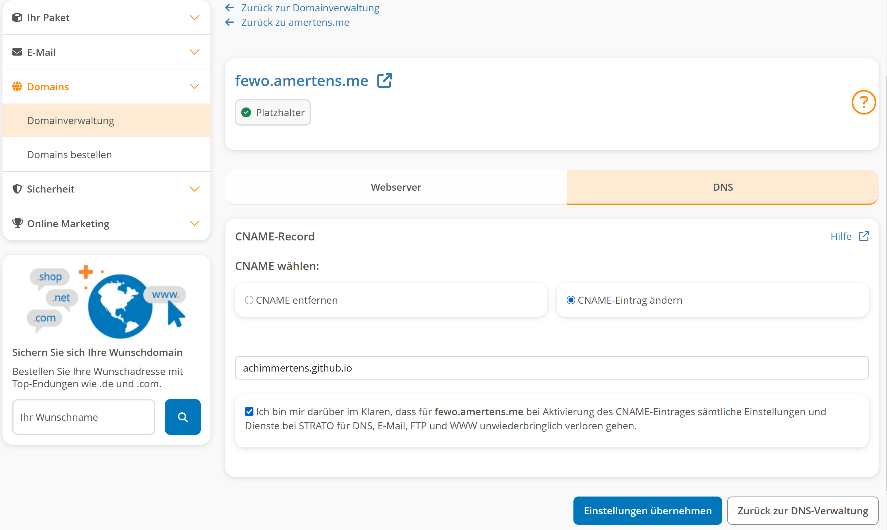
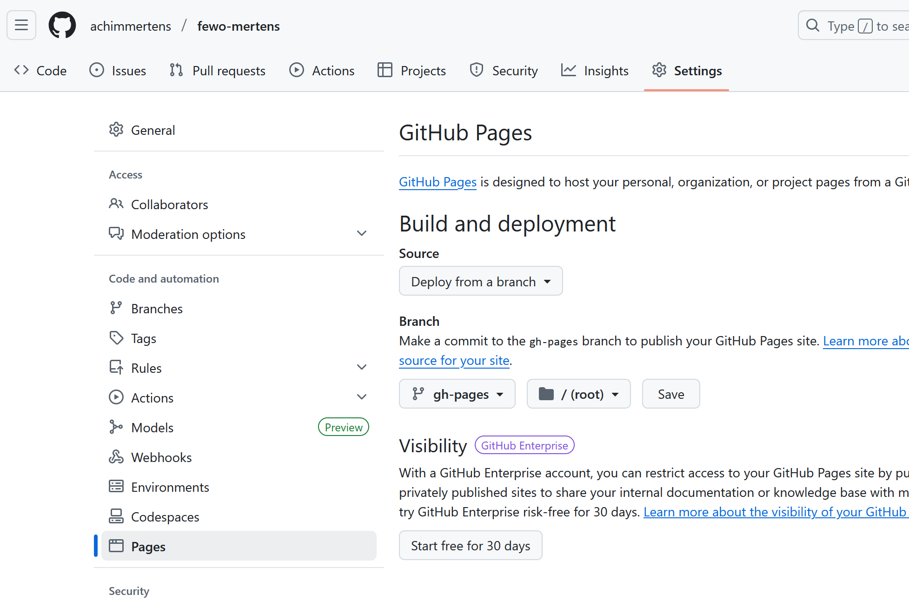

# Welcome to your Lovable project

## Project info

**URL**: https://lovable.dev/projects/5b77579e-f46e-4ea4-84ba-b0184d98ed84

## How can I edit this code?

There are several ways of editing your application.

**Use Lovable**

Simply visit the [Lovable Project](https://lovable.dev/projects/5b77579e-f46e-4ea4-84ba-b0184d98ed84) and start prompting.

Changes made via Lovable will be committed automatically to this repo.

**Use your preferred IDE**

If you want to work locally using your own IDE, you can clone this repo and push changes. Pushed changes will also be reflected in Lovable.

The only requirement is having Node.js & npm installed - [install with nvm](https://github.com/nvm-sh/nvm#installing-and-updating)

Follow these steps:

```sh
# Step 1: Clone the repository using the project's Git URL.
git clone <YOUR_GIT_URL>

# Step 2: Navigate to the project directory.
cd <YOUR_PROJECT_NAME>

# Step 3: Install the necessary dependencies.
npm i

# Step 4: Start the development server with auto-reloading and an instant preview.
npm run dev
```

**Edit a file directly in GitHub**

- Navigate to the desired file(s).
- Click the "Edit" button (pencil icon) at the top right of the file view.
- Make your changes and commit the changes.

**Use GitHub Codespaces**

- Navigate to the main page of your repository.
- Click on the "Code" button (green button) near the top right.
- Select the "Codespaces" tab.
- Click on "New codespace" to launch a new Codespace environment.
- Edit files directly within the Codespace and commit and push your changes once you're done.

## What technologies are used for this project?

This project is built with .

- Vite
- TypeScript
- React
- shadcn-ui
- Tailwind CSS

## How can I deploy this project?

Simply open [Lovable](https://lovable.dev/projects/5b77579e-f46e-4ea4-84ba-b0184d98ed84) and click on Share -> Publish.

## I want to use a custom domain - is that possible?

We don't support custom domains (yet). If you want to deploy your project under your own domain then we recommend using Netlify. Visit our docs for more details: [Custom domains](https://docs.lovable.dev/tips-tricks/custom-domain/)

# Schritt-für-Schritt: GitHub Pages für eine Node.js-Webseite einrichten
🧱 Beispiel: Du hast ein Projekt mit z. B. Vue.js, Vite oder React
1. Seite lokal bauen

In deinem Projektordner:

npm install
npm run build

➡️ Das erzeugt einen Ordner (z. B. dist/ oder build/), der die statische Version deiner Seite enthält.
2. Den statischen Build auf einen separaten Branch pushen

GitHub Pages kann Inhalte aus einem Branch wie gh-pages anzeigen.
Dazu kannst du das Paket gh-pages nutzen:
a) Installieren:

npm install --save-dev gh-pages

b) In deiner package.json:

Füge Folgendes hinzu:

"scripts": {
  "predeploy": "npm run build",
  "deploy": "gh-pages -d dist"
}

(ersetze dist durch deinen Build-Ordnernamen)
c) Deployment:

npm run deploy

➡️ Dadurch wird dein dist-Ordner auf den Branch gh-pages gepusht und öffentlich verfügbar gemacht.
3. GitHub Pages aktivieren

    Gehe auf deine Repository-Seite bei GitHub

    Klicke auf Settings > Pages

    Wähle bei Source den Branch gh-pages und ggf. den Ordner / aus

    Speichern – nach ein paar Sekunden ist deine Seite unter:

    https://dein-github-nutzername.github.io/repository-name/

🌍 4. Eigene Domain (z. B. amertens.me) verbinden
a) CNAME-Datei erstellen

Lege im dist/-Ordner (vor dem Deployment) eine Datei namens CNAME an mit folgendem Inhalt:

amertens.me

Dann wird diese Datei bei npm run deploy mit hochgeladen.
b) Domain bei deinem Provider (Strato) umstellen:

    Logge dich bei Strato ein

    Gehe zum DNS-Editor für amertens.me

    Erstelle einen CNAME-Eintrag für www mit folgendem Ziel:

<dein-github-nutzername>.github.io.

(Beispiel: meinname.github.io. – Punkt am Ende ist wichtig bei manchen DNS-Systemen)

    Für die root-Domain (amertens.me ohne www) musst du ggf. A-Records setzen, oder einen Redirect von Strato auf www.amertens.me einrichten (Strato kann das).

    

🧪 Testen

Nach ein paar Minuten sollte deine Webseite unter amertens.me erreichbar sein.
📝 Zusammenfassung
Schritt	Beschreibung
npm run build	Statischen Build erstellen
npm run deploy	Mit gh-pages auf GitHub hochladen
GitHub Settings > Pages	Branch gh-pages auswählen

CNAME-Datei	Domain festlegen
DNS bei Strato	CNAME auf github.io setzen